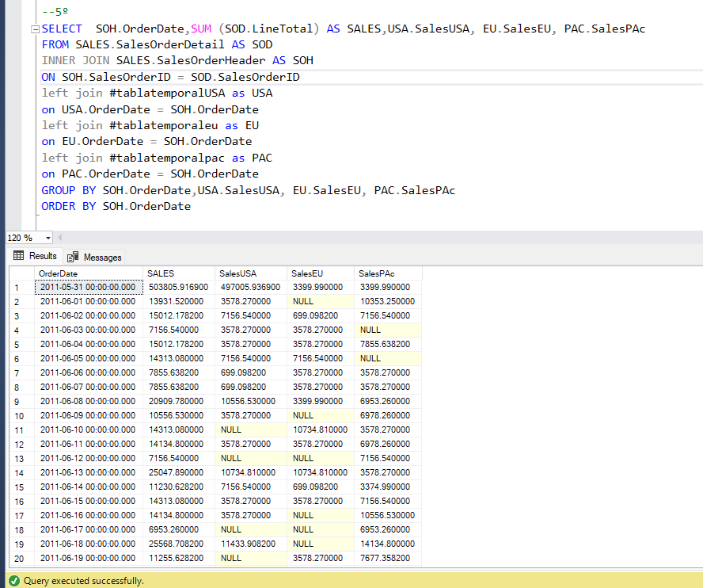
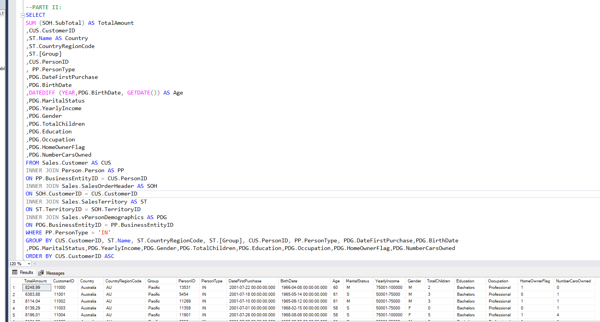
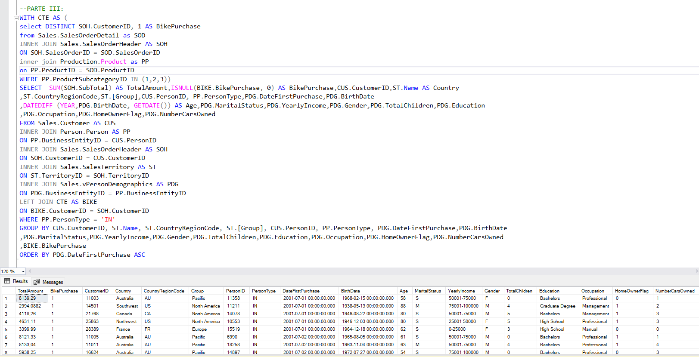

# Consultas analíticas de ventas (SQL | AdventureWorks2017)

## Objetivos
Transformar datos de una base **OLTP (AdventureWorks2017)** en **datasets analíticos listos para reporting y modelado**:
1) serie temporal de ventas (total y por región),  
2) dataset de clientes para regresión,  
3) dataset de clientes para clasificación con variable objetivo `BikePurchase`.

**Script completo:** [Ver queries.sql](./queries.sql)

---

## Entorno
- **SQL Server (T-SQL)**
- Base de datos: **AdventureWorks2017**

---

## 1 — Series temporales de ventas (2011–2014)
**Objetivo:** ventas diarias globales y por región (North America, Europe, Pacific) y dataset final combinado por fecha.

**Decisión clave:** al combinar regiones se usa `LEFT JOIN` por fecha para **no perder días** donde una región no tenga ventas (serie completa y comparable). 

### Evidencia (resultado)

## 2 — Dataset de clientes para regresión
**Objetivo:** dataset por cliente con gasto acumulado y variables demográficas (edad, ingresos, educación, etc.).

**Decisión clave:** Hacer que el dataset tenga **1 fila por cliente** y calcular el **gasto total** sumando sus compras (`TotalAmount`). Después añado las variables demográficas y me quedo solo con clientes particulares (`PersonType = 'IN'`).

### Evidencia (resultado)

## 3 — Dataset de clientes para clasificación (BikePurchase)
**Objetivo:** crear la variable objetivo BikePurchase (1 si compró bicicleta, 0 si no).

**Decisión clave:** Crear la variable `BikePurchase` con dos valores claros (**1 = compró**, **0 = no compró**). Para no perder clientes, uso `LEFT JOIN` y convierto los `NULL` en 0 con `ISNULL`, dejando la etiqueta lista para modelos de clasificación.

### Evidencia (resultado)

