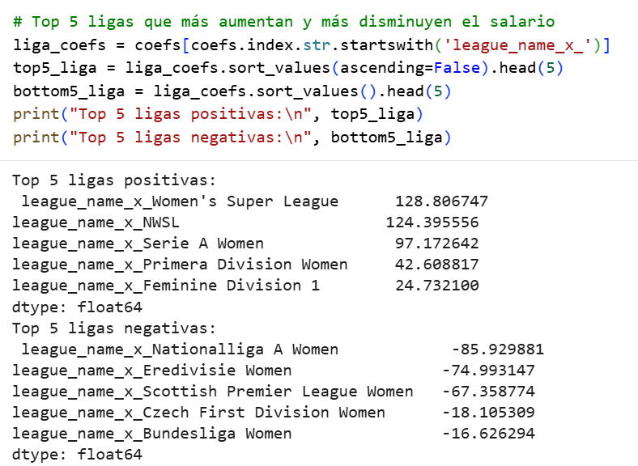

# Proyecto Python — Actividad INA (AdventureWorks / FIFA)

## Objetivo
Análisis exploratorio y modelado (regresión lineal) para explicar variables objetivo a partir de variables numéricas y categóricas, incluyendo interpretación de coeficientes del modelo.

## Entregables
- Notebook: `Actividad_3_INA.ipynb`
- Capturas de resultados en `screenshots/`

## Código
- [Ver notebook en GitHub](https://github.com/lucia-ferreno-pico/Portfolio/blob/main/02_python/actividad_ina_fifa/Actividad_3_INA.ipynb)

## Capturas

### Matriz de correlación

### Top ligas (coeficientes del modelo)

### Salario medio por club

