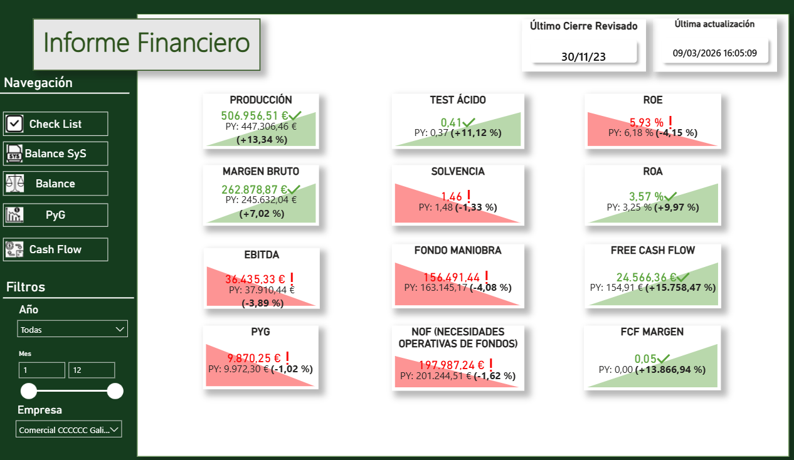
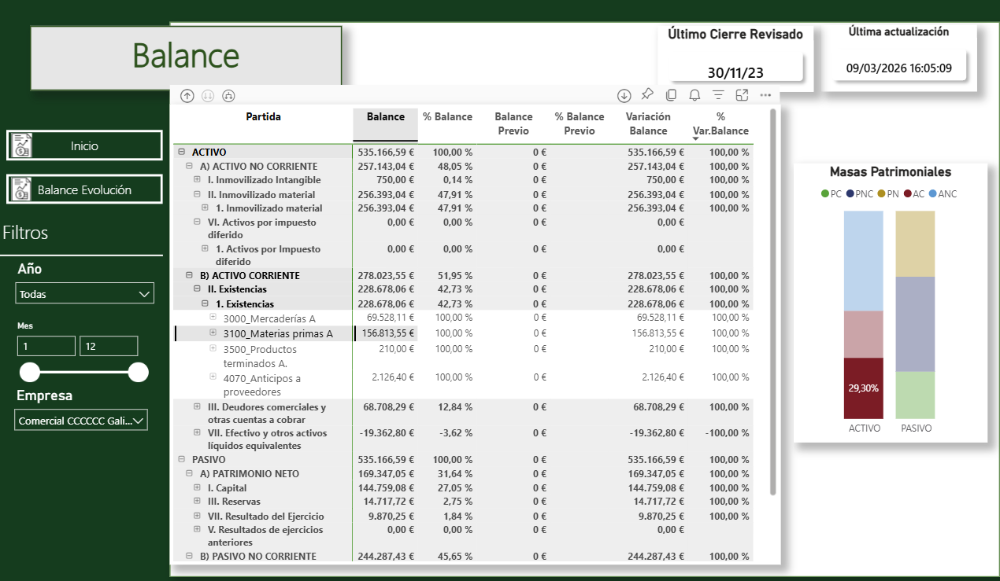
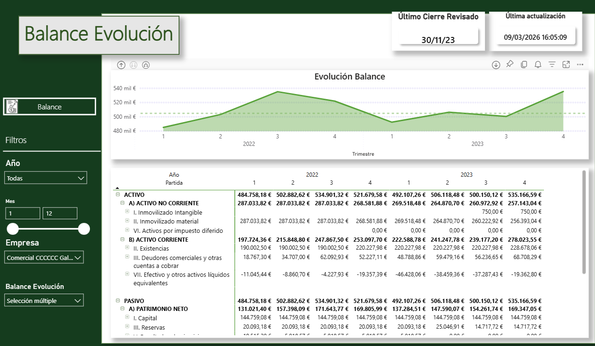
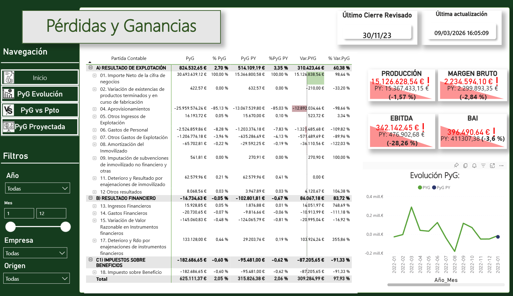
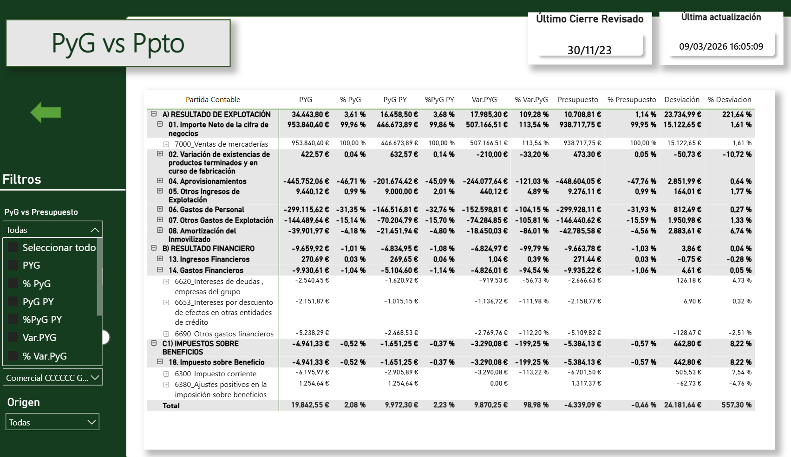
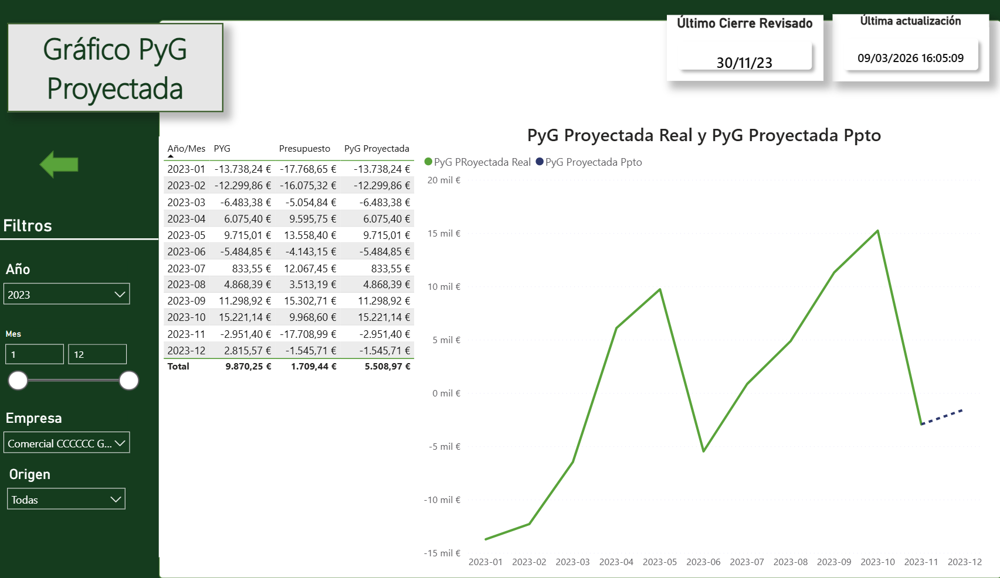
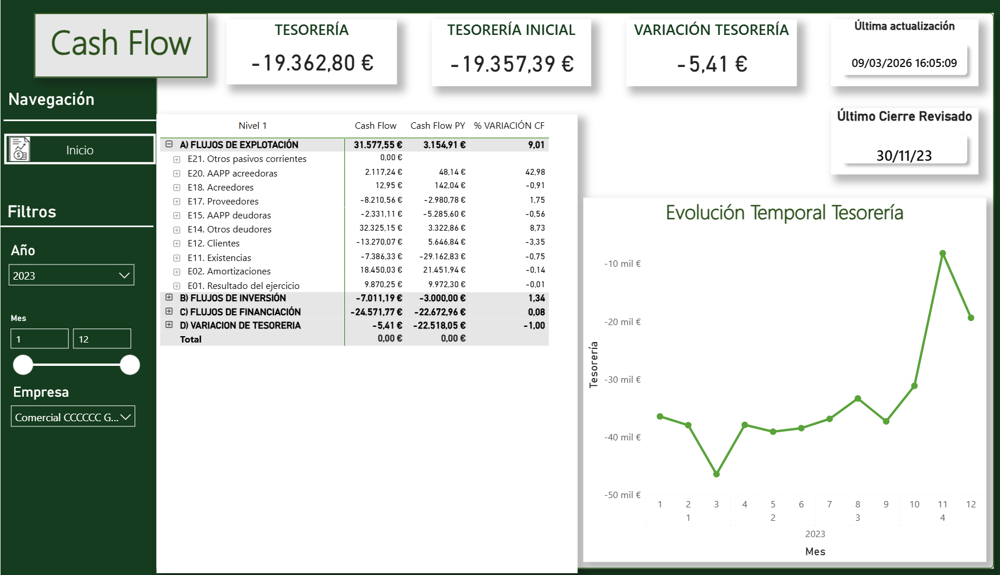

# Dashboard Financiero y de Análisis Contable — Power BI

## Resumen
Este proyecto consiste en una solución de reporting financiero desarrollada en Power BI para centralizar el análisis económico-financiero de tres empresas en una única interfaz interactiva.

En el dashboard combino visión ejecutiva y análisis de gestión, permitiendo así revisar de forma rápida la situación financiera, la rentabilidad, la liquidez, la evolución del resultado, la comparación con presupuesto y el comportamiento de la tesorería. 

Además, incorporo navegación hacia vistas de apoyo (detalle de asientos y libro mayor) para profundizar en el análisis cuando se considere necesario, alcanzando el maximo nivel de detalle en cualquier dato.

---

## Objetivo
El objetivo principal que tuve fue construir una solución de reporting financiero que permitiera:

- Monitorizar KPIs financieros clave desde una vista ejecutiva
- Analizar la estructura patrimonial de la empresa
- Estudiar la evolución del resultado a lo largo del tiempo
- Comparar resultado real frente a presupuesto
- Incorporar una capa de proyección sobre PyG
- Seguir la evolución de la tesorería y los flujos de caja
- Conectar el resumen ejecutivo con vistas analíticas de apoyo

---

## Qué incluye el dashboard

### Panel ejecutivo
En la página principal reune los principales indicadores financieros para obtener una lectura rápida del estado del negocio. Se incluyen métricas de actividad, rentabilidad, liquidez, estructura financiera y generación de caja, comparadas con el periodo previo.

### Balance
La página de Balance permite revisar la composición del activo, pasivo y patrimonio neto, junto con su peso relativo y su comparación con el balance previo. Esto facilita el análisis de la estructura financiera y la identificación de variaciones relevantes.

### Balance Evolución
Esta vista añade una lectura temporal de las masas patrimoniales, permitiendo observar cómo evolucionan las principales partidas a lo largo de los periodos seleccionados.

### Pérdidas y Ganancias
La sección de PyG permite analizar el resultado de explotación, el resultado financiero y el resultado final, con desglose por partidas contables. Esta vista aporta una lectura estructurada del rendimiento económico del negocio.

### PyG vs Presupuesto
Esta página incorpora una comparación entre resultado real y resultado presupuestado, mostrando desviaciones absolutas y relativas. Añade una capa de control de gestión muy útil para el seguimiento presupuestario.

### PyG Proyectada
El informe incluye una vista específica de PyG Proyectada y un gráfico asociado para analizar la evolución esperada del resultado y compararla con la proyección presupuestaria.

### Cash Flow
La página de Cash Flow permite revisar los flujos de explotación, inversión y financiación, así como la variación de tesorería y su evolución temporal. Esta vista complementa el análisis de rentabilidad con una lectura clara de la caja.

---

## Estructura del informe
El reporting está organizado en 13 páginas:

1. Informe Financiero  
2. Check-List  
3. Balance SyS  
4. Libro Mayor  
5. Detalle Asiento  
6. Balance  
7. Balance Evolución  
8. Pérdidas y Ganancias  
9. PyG Evolución  
10. PyG vs Ppto  
11. PyG Proyectada  
12. Gráfico PyG Proyectada  
13. Cash Flow  

---

## Modelo de datos y enfoque
El dashboard está construido sobre un modelo relacional tipo de constelación en Power BI, con integración de movimientos contables, presupuestos, calendario y tablas auxiliares para el análisis financiero.

El enfoque combina:

- Modelado de datos
- Jerarquías contables
- Medidas DAX para KPIs y comparativas
- Navegación entre páginas y parametros de campo para generacion por el usuario de alguna de las tablas.
- Filtros dinámicos por año, mes, empresa y origen

Este planteamiento me permite reutilizar lógica analítica a lo largo de todo el informe y mantener consistencia entre vistas.

---

## Interacción y navegación

### Filtros
El usuario puede explorar la información mediante filtros por:

- Año
- Mes
- Empresa
- Origen
- Selecciones específicas según la página

### Navegación
El informe utiliza navegación lateral y botones de retorno entre páginas para facilitar el movimiento entre vistas ejecutivas y analíticas.

### Vistas de apoyo
Además del análisis principal, el dashboard incorpora páginas de apoyo que permiten profundizar en determinadas cifras cuando se necesita una revisión más analítica (libro mayor y detalle de asientos).

---

## KPIs destacados
Entre los principales indicadores incluidos en el dashboard se encuentran:

- Producción
- Margen Bruto
- EBITDA
- PyG
- Test Ácido
- Solvencia
- Fondo de Maniobra
- NOF
- ROE
- ROA
- Free Cash Flow
- FCF Margen

Estos indicadores se muestran con comparación frente al periodo anterior para facilitar la detección de cambios y tendencias.

---

## Capturas

### Panel ejecutivo

### Balance

### Balance evolución

### Pérdidas y Ganancias

### PyG vs presupuesto

### Gráfico PyG proyectada

### Cash Flow

---

## Entregables
- [Anexo dashboard (PDF)](https://github.com/lucia-ferreno-pico/Portfolio/blob/main/04_powerbi/dashboard_financiero/screenshots/reporting_financiero.pdf)

---

## Tecnologías utilizadas
- Power BI
- Power Query
- DAX
- Modelado de datos
- Reporting financiero
- Análisis contable

---

## Valor del proyecto
Este proyecto muestra cómo Power BI puede utilizarse para desarrollar una solución de reporting financiero completa, con capacidad de análisis, comparación, proyección y seguimiento de indicadores clave en un entorno visual e interactivo.
La obtencion del maximo nivel de granularidad hace que este dashboard sea una herramienta para los financieros de la empresa con la que pueden analizar la estructura del balance, de la cuenta de PyG, la liquidez, la rentabilidad y cash flow.
El resultado es un dashboard orientado a facilitar la toma de decisiones y a mejorar la lectura de la información financiera frente a formatos de reporting más estáticos.

## Notas
- Proyecto académico.
- Portfolio orientado a reporting financiero y análisis contable.
