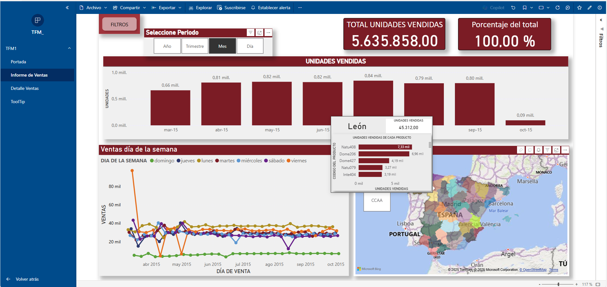
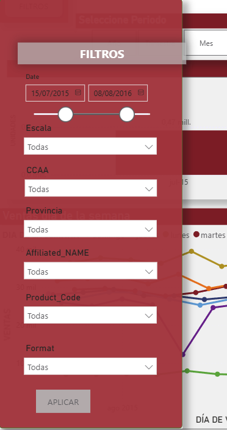
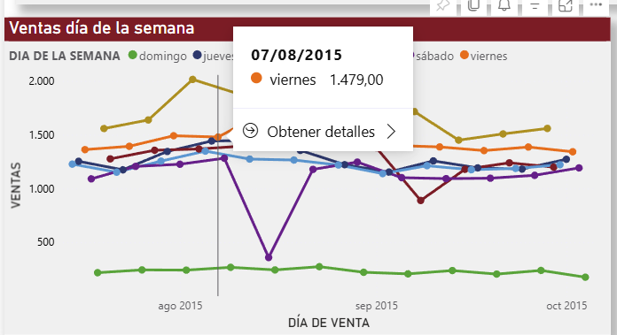
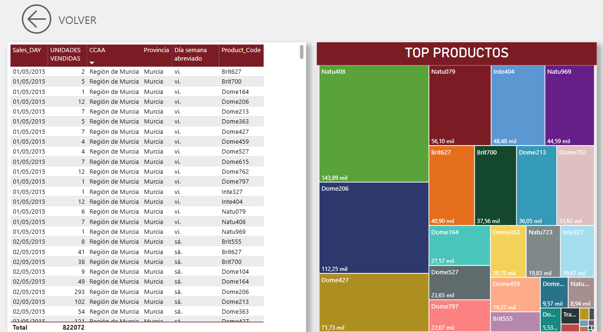
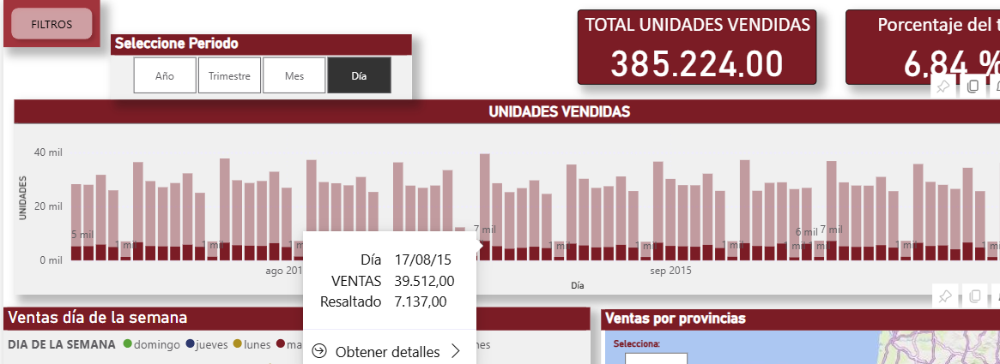

# Dashboard de Ventas — Power BI (Análisis interactivo)

## Resumen
Dashboard de ventas orientado a responder preguntas de negocio:
**¿qué se vende?, ¿dónde se vende?, ¿quién lo vende? y ¿cuándo se vende?**

Incluye navegación a detalle (drillthrough), menú de filtros avanzado, parámetros y tooltip dinámico geográfico.

---

## Objetivo
Facilitar el análisis exploratorio y operativo de las ventas mediante:
- KPIs dinámicos (unidades y % sobre el total)
- Evolución temporal con cambio de granularidad (día/mes/trimestre/año)
- Comparativas por territorio, punto de venta y producto
- Acceso a detalle del periodo seleccionado y desglose de productos
- Mapa con tooltip enriquecido por CCAA/provincia

## Estructura del informe (4 páginas)
1. **Portada**
2. **Informe de ventas (principal)**
3. **Detalle de ventas** (acceso desde “Obtener detalles”)
4. **Tooltip del mapa** (dinámico por CCAA / provincia)

---

## Modelo de datos y enfoque
### Modelo
- **Modelo estrella** (tabla de hechos + dimensiones).
- **Tabla calendario** para inteligencia temporal (jerarquías y periodos).
- **Parámetros** para controlar escala/nivel de detalle en visualizaciones.

### Datos (proyecto académico)
- Tablas: `Product`, `SalesDay`, `puntos_venta_enriquecido2`
- Granularidad: diaria

---

## Interacción y navegación
### Menú de filtros
Permite seleccionar:
- **Rango de fechas**
- **Escala temporal** (día / mes / trimestre / año)
- Filtros por **territorio** (CCAA / provincia), **punto de venta** y **producto**

### Drillthrough a detalle
- En el gráfico temporal se puede **Obtener detalles** para navegar a **Detalle de ventas**.
- Botón **Volver** para retornar a la página principal.

### Tooltip dinámico del mapa
- Al posicionarse sobre **CCAA/provincia** se muestra un tooltip con:
  - Unidades vendidas del territorio
  - **Top productos** y cantidad vendida (barras)

---

## KPIs principales
- **Unidades vendidas**
- **% sobre el total**
Los indicadores se recalculan dinámicamente con filtros y selecciones.

---

## Capturas

### Informe de ventas (vista general)

### Menú de filtros

### Tooltip del mapa (CCAA/Provincia + top productos)

### Ventas por día de la semana

### Página detalle de ventas

### Drillthrough (Obtener detalles)

---

## Entregables
- [Anexo dashboard (PDF)](https://github.com/lucia-ferreno-pico/Portfolio/blob/main/04_powerbi/dashboard_ventas/screenshots/dashboard_ventas.pdf)

---

## Cómo usar el dashboard (rápido)
1. Selecciona **periodo** y la **escala temporal** (día/mes/trimestre/año).
2. Filtra por **CCAA/provincia**, **punto de venta** y/o **producto**.
3. Revisa KPIs y visuales para identificar patrones de venta.
4. En el gráfico temporal usa **Obtener detalles** para ir a **Detalle de ventas**.
5. En el mapa, pasa el ratón por el territorio para ver el **tooltip** con top productos.

## Notas
- Proyecto académico (Master BI).

