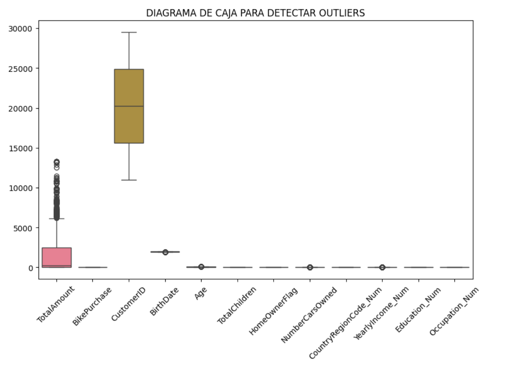
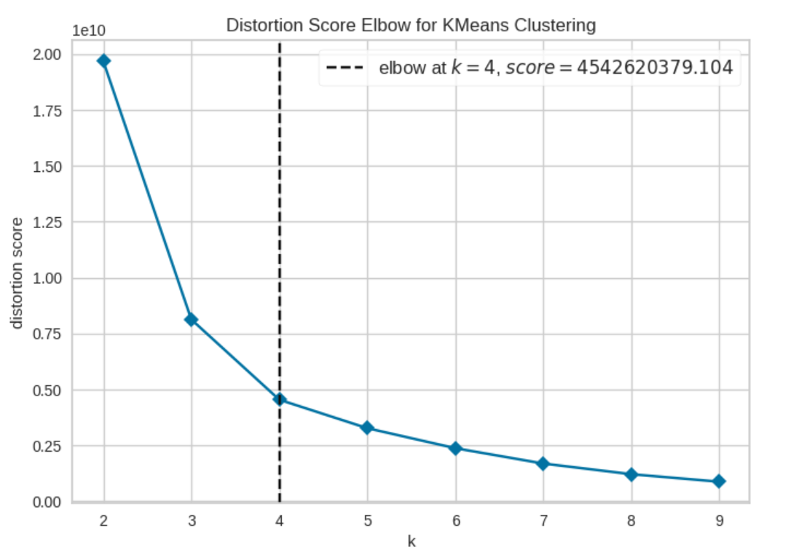
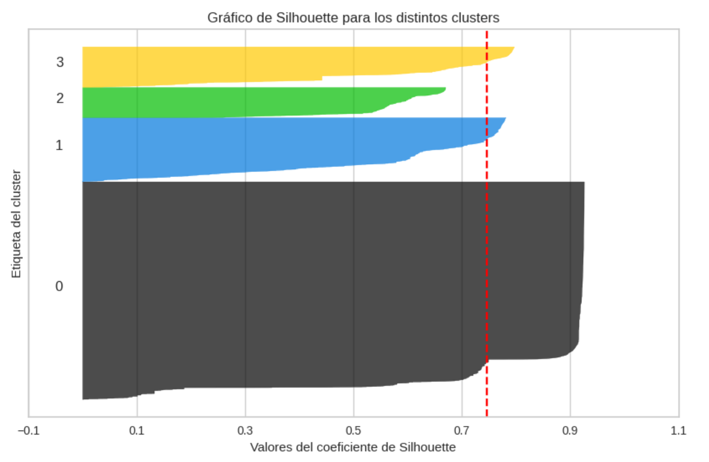

# AdventureWorks — Visión 360 y segmentación de clientes (CRM)

Proyecto de **análisis 360 de clientes** y **segmentación (clustering)** usando el dataset público **AdventureWorks**, con el objetivo de obtener segmentos accionables para **CRM/Marketing**.

---

## Archivos
- `Actividad_CRM.ipynb`: notebook principal (EDA → preparación → K-Means → evaluación → conclusiones).
- `dataset_AW.csv`: dataset público AdventureWorks utilizado.
- `README.md`: descripción del proyecto.
- `imgs/`: capturas clave del análisis. 

---

## Metodología
1. **Entendimiento del dato (EDA)**: revisión de variables, calidad del dato y análisis descriptivo.
2. **Preparación**: limpieza, selección de variables y transformaciones (incluida codificación de variables categóricas).
3. **Segmentación (K-Means)**: selección de K con **Elbow** y validación con **Silhouette**.
4. **Evaluación e interpretación**: perfilado de clusters y recomendaciones de negocio por segmento.

---

## Ejecución
- Abrir `Actividad_CRM.ipynb` en Colab o en Jupyter y ejecutar las celdas en orden. 

---

## Evidencias (capturas clave)

### 1) EDA — detección de outliers

### 2) Selección de K — método del codo
Se identifica **k = 4** como número óptimo de clusters.

### 3) Validación — Silhouette
La puntuación media del coeficiente de Silhouette es **0,745**, lo que indica un **buen agrupamiento** (cercano a 1).

---

## Resultados del análisis (visión 360)
Tras el análisis general se observa que:
- La mayoría de clientes gasta entre **0 y 1300 USD**.
- Aproximadamente **la mitad compra bicicleta** y la otra mitad no.
- El rango de edad predominante se sitúa entre **45 y 62 años**.
- Los clientes tienen **al menos un hijo**.
- La mayoría dispone de **vivienda en propiedad** y **al menos un coche**.
- La mitad de clientes es de **US** y el segundo país por volumen es **Australia**.
- Ingresos principalmente entre **25.000 y 75.000 USD**.
- Predominan **estudios universitarios**.
- Ocupaciones mayoritarias: **manual** o **profesional**.

Observaciones clave por variables:
- **TotalAmount**: distribución sesgada positivamente y relación positiva con **BikePurchase** y **YearlyIncome** (a mayor presupuesto, mayor probabilidad de compra y mayores ingresos).
- **Age**: concentración en tramos medios con algunos valores altos; relación positiva con **TotalChildren** y **Occupation_Num**.
- **NumberCarsOwned**: relación positiva con **YearlyIncome_Num** y **Occupation_Num**.
- **Education_Num**: relación positiva con **Occupation_Num** y **YearlyIncome_Num**.
- Variables binarias (**BikePurchase**, **HomeOwnerFlag**) ayudan a diferenciar compradores y perfiles patrimoniales.

---

## Preparación de datos
- Verificación de inexistencia de nulos.
- Eliminación de variables no relevantes para el análisis (por ejemplo: `CustomerID`, `BirthDate`, `PersonType`).
- Codificación de variables categóricas (`Gender`, `MaritalStatus`) a variables numéricas (`Gender_Num`, `MaritalStatus_Num`).

---

## Modelado y validación
- Segmentación con **K-Means** sobre variables:
  - `BikePurchase`, `TotalAmount`, `TotalChildren`, `Education_Num`, `Occupation_Num`, `YearlyIncome_Num`
- Selección de **k = 4** mediante **Elbow**.
- Validación con **Silhouette medio = 0,745**, indicando buena cohesión y separación entre clusters.

---

## Segmentos identificados (interpretación de negocio)
Se identifican cuatro perfiles con implicaciones comerciales diferenciadas:

- **Cluster 0**: clientes con presupuestos bajos, que prácticamente no compran bicicletas y con ingresos anuales medios-bajos.  
- **Cluster 1**: clientes que mayoritariamente compran bicicletas, con presupuestos medios-bajos e ingresos medios-bajos.  
- **Cluster 2**: clientes que compran bicicletas, con presupuestos e ingresos medios-altos (perfil premium).  
- **Cluster 3**: clientes que compran bicicletas, con presupuestos e ingresos medios y con hijos (perfil familiar).  

---

## Estrategia por segmento (acciones recomendadas)

| Cluster | Perfil resumido | Qué vender / enfoque | Acciones recomendadas |
|---|---|---|---|
| **0** | Presupuesto bajo, casi no compra bicicletas, ingresos medio–bajos | Productos de menor valor (piezas, accesorios) y activación | Campañas de **reactivación** y **primeras compras repetidas**; bundles económicos; cupones y **descuentos**. Analizar sensibilidad al precio y respuesta a programas de incentivos. |
| **1** | Mayoría compra bicicletas, presupuesto medio–bajo, ingresos medio–bajos | Bicicletas de entrada y gama económica | Promociones de **gama económica**; financiación; **cross-sell** de accesorios; upsell progresivo (mantenimiento, upgrades). |
| **2** | Compra bicicletas, presupuesto e ingresos medio–altos (perfil premium) | Productos premium, upgrades y servicios | **Fidelización exclusiva**: programas premium, ventajas, preventa, eventos, mantenimiento preferente. Enfoque a maximizar **LTV**. |
| **3** | Compra bicicletas, presupuesto e ingresos medios, con hijos (perfil familiar) | Packs y soluciones familiares | Ofertas **familiares**: descuentos multi-compra, packs infantiles/familia, campañas estacionales (ocio, vuelta al cole). |

---

## Conclusiones (resumen)
- El modelo identifica **4 clusters** coherentes y accionables. La validación mediante **Silhouette medio = 0,745** indica un **buen agrupamiento**.
- El análisis 360 muestra un perfil predominante: gasto **0–1300 USD**, ingresos **25.000–75.000 USD**, edades **45–62**, con **hijos**, **vivienda en propiedad** y **al menos un coche**; con mayor volumen en **US** y después **Australia**.
- Se observan relaciones consistentes entre variables: **TotalAmount** se asocia con compra de bicicleta e ingresos; **Education/Occupation/Income** mantienen coherencia socioeconómica.
- La segmentación permite **focalizar campañas y optimizar recursos**:
  - Bicicletas y productos de mayor valor: priorizar **clusters 1, 2 y 3**.
  - Accesorios/piezas y activación: orientar al **cluster 0**, valorando su sensibilidad a descuentos.
- Beneficio principal: mejor **diseño de estrategias comerciales** y mejora del **ROI** al reducir el público objetivo y personalizar mensajes por segmento.

<!-- deploy 1-->

